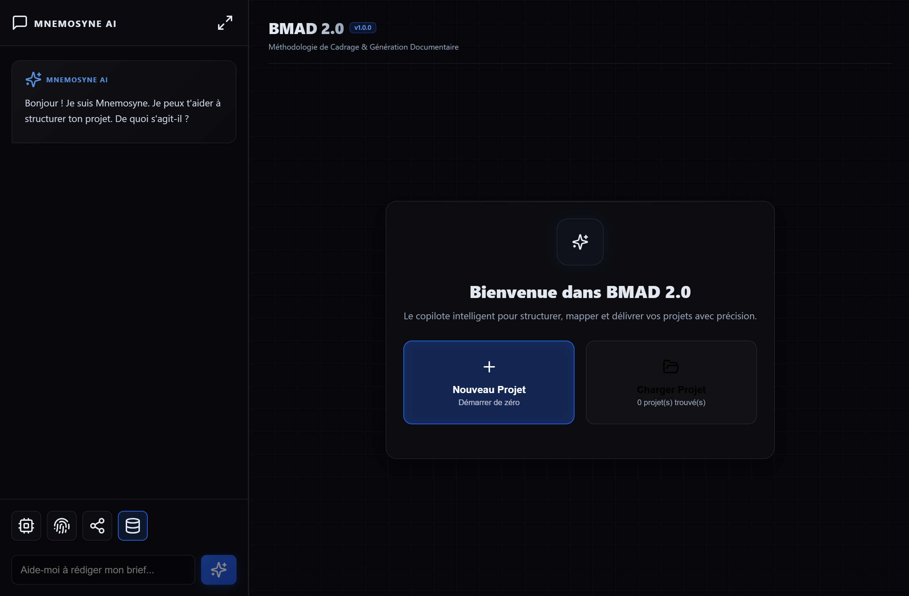
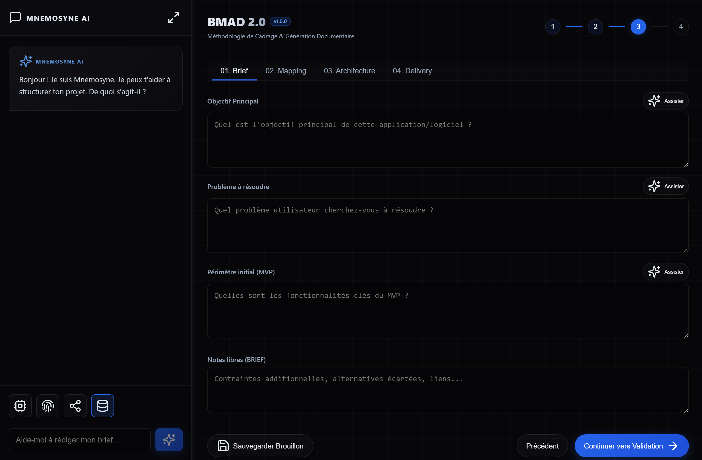
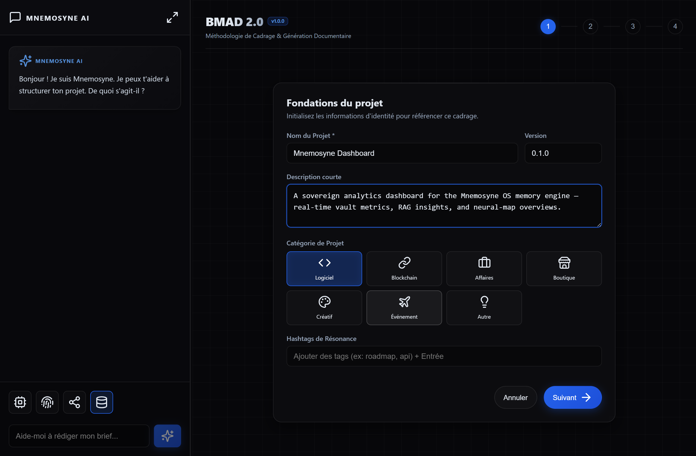
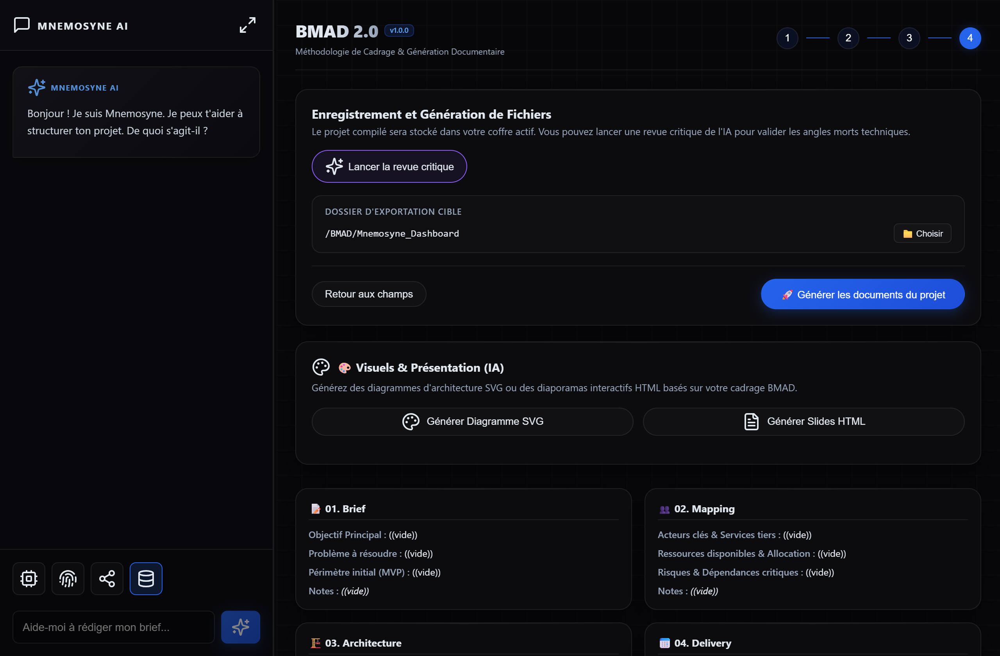
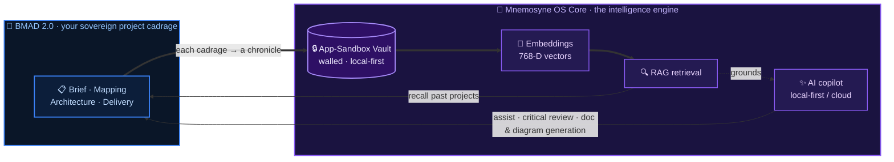

# 🧭 BMAD 2.0 — Brief · Mapping · Architecture · Delivery

[](https://github.com/yaka0007/Mnemosyne-Neural-OS)
[](./LICENSE.md)

**BMAD 2.0** is an AI-assisted **project scoping studio** for **Mnemosyne OS**. It turns a raw idea into a structured, validated *cadrage* — **B**rief, **M**apping, **A**rchitecture, **D**elivery — and then generates the documents from it: Markdown specs, SVG architecture diagrams, and HTML slide decks. A copilot assists every field, and every project is archived into your sovereign vault.

> [!IMPORTANT]
> **BMAD 2.0 is a cartridge — it runs inside Mnemosyne OS.** Install the host app first, then load this cartridge from MnemoHub (or link it in dev mode).
>
> [](https://github.com/yaka0007/Mnemosyne-Neural-OS/releases/latest) &nbsp; [](https://github.com/yaka0007/Mnemosyne-Neural-OS)



---

## ✨ Key Capabilities

### 🧭 1. The BMAD method — one structured cadrage
Four linked tabs take a project from intent to plan: **01. Brief** (objective, problem, MVP scope), **02. Mapping** (actors, resources, risks & dependencies), **03. Architecture**, and **04. Delivery**. Every field has a one-click **✨ Assister** button that drafts or sharpens it with the model.



### 🧱 2. Guided foundations
Start from a clean identity card — name, version, short description, project category (Software, Blockchain, Business, Shop, Creative, Event…) and resonance hashtags — so every cadrage is referenceable later.



### 🤖 3. A copilot at your side
A persistent **Mnemosyne AI** sidebar helps you draft your brief in plain language, while per-field assist and an **AI critical review** hunt for the technical blind spots before you commit.

### 🚀 4. Delivery & generation
Compile the cadrage into your active vault, run the **critical review**, and generate the deliverables: project **Markdown documents**, an **SVG architecture diagram**, or an **interactive HTML slide deck** — all built from your BMAD scoping.



### 🌍 5. Trilingual, host-synced
Full **EN / FR / ES** UI, kept in sync with the Mnemosyne OS host language.

---

## 🧠 Connected to the Mnemosyne OS Core

BMAD 2.0 is not a standalone form with an AI button bolted on — it's a **cartridge that plugs straight into the Mnemosyne OS intelligence engine**. The split is deliberate:

- **BMAD owns the data.** Your project cadrages — briefs, mappings, architecture, delivery plans — the sovereign design memory of *your* ideas. They live locally and are never sent to a third-party server.
- **Mnemosyne OS owns the intelligence.** Every cadrage is compiled into a vectorized *chronicle* inside a **walled app-sandbox vault** — isolated from the rest of your memory until you decide otherwise. From there the core engine powers the studio:
  - **The AI copilot & per-field assist** — draft an objective, sharpen a risk list, or run a full critical review with a model that runs on your machine.
  - **Document & diagram generation** — turn the cadrage into Markdown specs, SVG architecture diagrams, and HTML slides.
  - **Semantic recall (RAG)** — 768-dimensional embeddings let past projects be found and reused by *meaning*.

The intelligence comes **to** the data; the data never leaves your machine (an optional cloud model kicks in only when you choose it — for richer diagrams and slides).



> Your project designs stay in the walled vault on your own machine — the core simply brings the intelligence to them. Nothing is sent to a third-party server.

---

## 🚀 Installation & Running

To run the cartridge in sandbox/development mode:

```bash
# Install dependencies
npm install

# Start the local dev server
npm run dev
```

The app starts at `http://localhost:5190/`. You can run it standalone or load it as a cartridge inside a **Mnemosyne OS** host instance (the vault archiving, model inference, and file export run host-side).

---

## ⚖️ License

Distributed under the **Mnemosyne OS Cartridge License**. You are free to inspect, modify, and customize the code as long as it executes and distributes within the **Mnemosyne OS** ecosystem.

For commercial use, redistribution outside the platform, or standalone hosting, please see the [LICENSE.md](./LICENSE.md) file.
